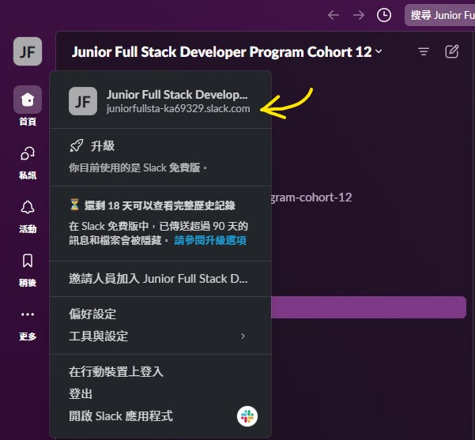

# Weekly-schedule

Due to the CORS (Cross-Origin Resource Sharing) policy, development and testing are only permitted in a Chrome extension environment.\

### Install

`npm run build`

Load unpacked extension in chrome and select the `build` directory

```
weekly-schedule
│-- build
|-- node_modules
└───public
|   |-- ...
│
└───src
│   │-- components
│   │-- App.js
|   |-- ...
|
|-- package.json
|-- README.md
|-- ...
```

### Development

1. Install in chrome first
2. Open url\
   replace {extension-id} to your chrome extension ID
    > chrome-extension://{extension-id}/index.html

> [!NOTE]
> You can also disable the relevant APIs and run UI development locally using `npm start`

# How to find your slack workspace URL?



# git cheat sheet

1. `git pull --rebase upstream main`
2. `git add.`
3. `git rebase --contine`
4. `:x`
5. `git push --force origin main`
